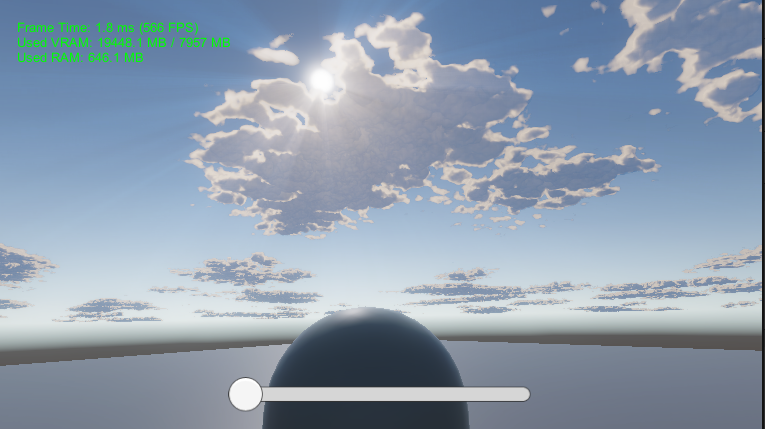
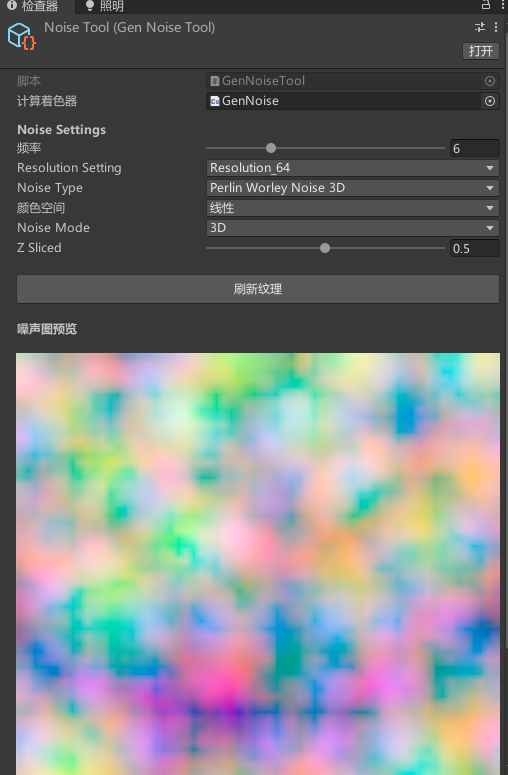

# 🌤️ URP Volumetric Clouds 风格化体积云渲染练习

基于 Unity Universal Render Pipeline (URP) 的风格化体积云渲染。

 

## ✨ 功能特性 (Features)
*   **Unity版本**：Unity 2022.3.8f1c1
*   **性能优化**：
    *   **交错分帧渲染 (Interleaved Rendering)**：基于 4x4 Bayer 矩阵的时间切片渲染，配合历史坐标重投影（Reprojection）。
    *   **动态步长控制 (Adaptive Raymarching)**：搜索阶段大步长，采集阶段细步长。
    *   **降采样**：降低RT分辨率
*   **丁达尔效应**：径向模糊后处理模拟丁达尔效应。
*   **噪声纹理生产工具**：生成2D/3D噪声:perlin noise ; worley noise ; perlin-worley noise ;
*                          

## 📂 目录结构
* `/Assets/Scripts`: C# 渲染管线控制代码
* `/Assets/Shader`: HLSL 体积云渲染与后处理源码
